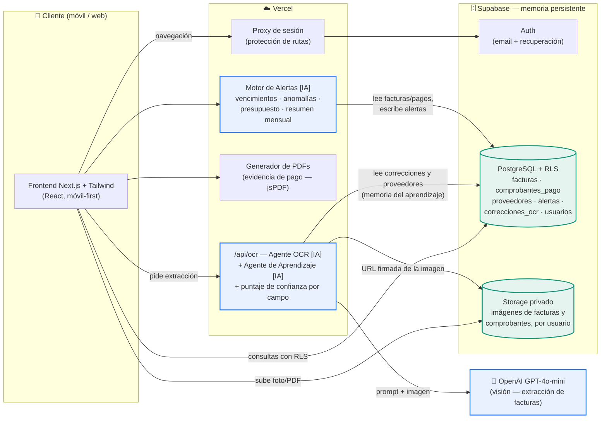
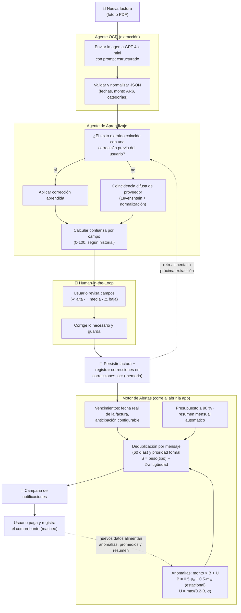
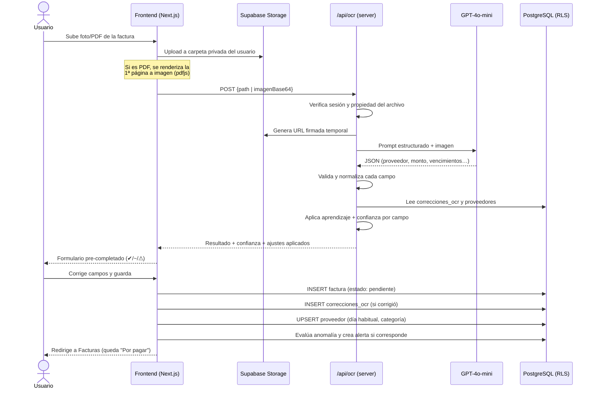

# Arquitectura — HogarFinance IA

Tres vistas del sistema: arquitectura general (componentes y flujo de datos),
flujo de agentes con su ciclo de retroalimentación, y un diagrama UML de
secuencia de la interacción principal (cargar una factura con OCR).

---

## 1. Diagrama de arquitectura general

Convención: los nodos marcados **[IA]** son componentes de inteligencia
artificial; el resto es lógica tradicional. La **memoria persistente** del
sistema vive en PostgreSQL y Storage (racimo inferior derecho).

**Flujo de datos de entrada a salida:** el usuario sube una factura (entrada) →
Storage la guarda → `/api/ocr` la envía al modelo de visión y aplica el
aprendizaje → el frontend muestra los campos pre-completados con su confianza →
el humano valida/corrige → PostgreSQL persiste factura, correcciones y
estadísticas → el motor de alertas produce avisos y el generador de PDFs produce
la evidencia (salidas).

---

## 2. Flujo de agentes y ciclo de retroalimentación

**Qué decide cada agente:** el OCR decide *qué dice la factura*; el aprendizaje
decide *si lo extraído debe ajustarse según el historial del usuario y con
cuánta confianza*; el humano decide *la verdad final* (ninguna escritura ocurre
sin su confirmación); el motor de alertas decide *cuándo avisar y con qué
prioridad*. Se comunican a través de la memoria persistente (PostgreSQL), lo
que hace el ciclo **cíclico**: cada corrección y cada pago mejoran la próxima
iteración.

---

## 3. UML — Diagrama de secuencia: "Cargar una factura con OCR"

